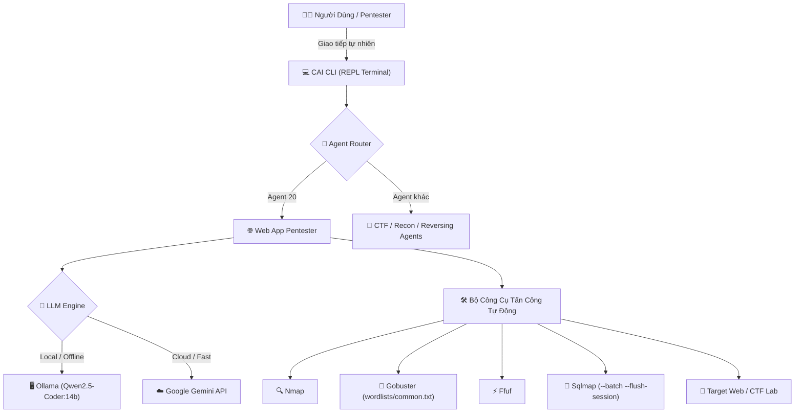

<div align="center">

# CAI_LO 🛡️🤖

**Hệ thống AI Agent Tự Động Hóa Kiểm Thử Xâm Nhập (Pentest), Khai Thác Lỗ Hổng Web & Hỗ Trợ Giải Đề CTF**

*Tích hợp sâu các công cụ Nmap, Gobuster, Ffuf, Sqlmap cùng mô hình Hybrid Cloud (Google Gemini) & Local LLMs (Ollama / Qwen2.5-Coder).*

[](https://github.com/tuanhoma/CAI_LO)
[](https://www.python.org/)
[](https://github.com/tuanhoma/CAI_LO)
[](https://ollama.ai/)
[](https://aistudio.google.com/)
[](LICENSE)

[⚡ Chạy 1-Click](#-hướng-dẫn-cài-đặt--chạy-1-click-tải-về-dùng-ngay) • [Tính năng nổi bật](#-tính-năng-nổi-bật) • [Kiến trúc hệ thống](#️-kiến-trúc-hệ-thống) • [Công cụ tích hợp](#-bộ-công-cụ-pentest-tích-hợp) • [Hướng dẫn sử dụng](#-hướng-dẫn-sử-dụng) • [Kịch bản thực chiến](#-kịch-bản-thực-chiến-mẫu) • [Xử lý sự cố](#️-xử-lý-sự-cố-thường-gặp)

</div>

---

## ⚡ Hướng Dẫn Cài Đặt & Chạy 1-Click (Tải về dùng ngay)

Dự án đã được đóng gói sẵn script tự động kiểm tra môi trường, tạo virtual environment (`cai_env`), cài đặt dependencies và cấu hình mặc định.

### Bước 1: Clone repository về máy
```bash
git clone https://github.com/tuanhoma/CAI_LO.git
cd CAI_LO
```

### Bước 2: Chạy ngay 1-Click

#### 🪟 Trên Windows:
Nhấp đúp chuột vào file **`run_cai.bat`** (hoặc chạy trong PowerShell / CMD):
```cmd
.\run_cai.bat
```
> Script sẽ tự động:
> 1. Kiểm tra Python (hỗ trợ tốt nhất Python 3.10 - 3.12).
> 2. Khởi tạo môi trường ảo `cai_env` (nếu chưa có).
> 3. Tự động chạy `pip install -e .` cài đặt framework.
> 4. Khởi tạo sẵn file `.env` từ `.env.example`.
> 5. Khởi động thẳng vào **Agent 20 (Web App Pentester)** sẵn sàng nhận lệnh.

#### 🐧 Trên Linux / macOS / WSL2:
Cấp quyền thực thi và chạy script:
```bash
chmod +x run_cai.sh
./run_cai.sh
```

---

## ⚙️ Cài đặt các công cụ bổ trợ (Prerequisites)

Để Agent có thể thực thi đầy đủ các lệnh dò quét và khai thác, hãy cài đặt các công cụ sau trên máy:

### 1. Mô hình AI Cục bộ (Ollama - Khuyến nghị cho Pentest tự do, không bị lọc nội dung)
1. Tải và cài đặt Ollama từ [ollama.ai](https://ollama.ai).
2. Tải model lập trình & bảo mật mạnh mẽ:
   ```bash
   ollama run qwen2.5-coder:14b
   # Hoặc máy cấu hình nhẹ hơn:
   ollama run qwen2.5-coder:7b
   ```

### 2. Bộ công cụ Pentest
- **Windows:**
  - Cài qua [Scoop](https://scoop.sh) hoặc Chocolatey:
    ```powershell
    scoop install nmap sqlmap gobuster ffuf
    ```
- **Linux (Debian / Ubuntu / Kali Linux):**
  ```bash
  sudo apt update && sudo apt install -y nmap sqlmap gobuster ffuf
  ```

---

## ✨ Tính năng nổi bật

### 1. 🎯 Tối ưu hóa Agent 20 (Web App Pentester)
Agent chuyên trách tự động hóa chu trình kiểm thử xâm nhập ứng dụng web theo chuẩn OWASP:
- **Reconnaissance:** Tự động gọi `nmap` quét mở cổng dịch vụ.
- **Directory / Content Discovery:** Sử dụng `gobuster` hoặc `ffuf` dò tìm file ẩn (`login.php`, `admin`, `api`, `config`,...).
- **Vulnerability Assessment & Exploitation:** Sử dụng `sqlmap` tự động phát hiện và dump cơ sở dữ liệu khi phát hiện tham số dễ tổn thương.
- **Tích hợp sẵn Wordlist (`wordlists/common.txt`):** Tự động phát hiện wordlist tích hợp sẵn trong thư mục dự án, tránh lỗi người dùng thiếu từ điển.

### 2. 🧠 Cơ chế Function Calling & Tool Parser Nâng Cao cho Ollama
- Khắc phục triệt để tình trạng các mô hình mã nguồn mở (như Qwen2.5, Llama-3) in JSON tool call vào phần text mà không kích hoạt gọi hàm.
- Tự động nhận diện mảng JSON `[{...}]` hoặc đối tượng JSON nối tiếp, phân tích cú pháp và kích hoạt tool ngay lập tức.
- Cơ chế chống lặp vô tận (Anti-Loop Protection) giúp luồng tương tác luôn mượt mà.

### 3. 🌐 Cơ Chế Hybrid Multi-LLM
- **Local LLMs (Ollama):** Hoàn toàn riêng tư, không cần internet, không bị kiểm duyệt an toàn khi audit target nội bộ / CTF lab.
- **Cloud LLMs (Google Gemini 2.5 / 3.5 Flash):** Tốc độ phản hồi cực nhanh, tự động xử lý và loại bỏ các token cache gây lỗi `429 Too Many Requests`.

---

## 🛠️ Bộ công cụ Pentest tích hợp

| Công cụ | Mô-đun | Chức năng chính | Cải tiến trong CAI_LO |
| :--- | :--- | :--- | :--- |
| **`nmap`** | `cai.tools.reconnaissance.nmap` | Quét cổng & dịch vụ mạng | Tự động làm sạch URL (`http://`, port) thành target IP/host hợp lệ |
| **`gobuster`** | `cai.tools.web.gobuster` | Dò quét thư mục & vhost | Tự động fallback về wordlist có sẵn trong repo |
| **`ffuf`** | `cai.tools.web.ffuf` | Fuzzing đường dẫn & tham số HTTP | Fuzzing tốc độ cao, tự động bổ sung tham số wordlist |
| **`sqlmap`** | `cai.tools.exploitation.sqlmap` | Tự động hóa khai thác SQLi & dump DB | Tự động thêm `--batch` (chạy không hỏi lại) & `--flush-session` tránh cache cũ |
| **`generic_linux_command`** | `cai.tools.reconnaissance` | Chạy lệnh hệ điều hành tùy biến | Sửa lỗi tương thích tham số Pydantic trên Windows |

---

## 🏗️ Kiến trúc hệ thống



---

## 💻 Hướng dẫn sử dụng

### 1. Khởi động nhanh
```bash
# Vào thẳng Web Pentester (Agent 20)
cai --agent 20

# Hoặc vào giao diện chọn Agent
cai
```

### 2. Các lệnh điều khiển trong phiên
| Lệnh | Chức năng | Ví dụ |
| :--- | :--- | :--- |
| `/agent <số hoặc tên>` | Đổi Agent làm việc | `/agent 20` (Web App Pentester) |
| `/model <tên>` | Đổi mô hình LLM trực tiếp | `/model ollama/qwen2.5-coder:14b` hoặc `/model gemini/gemini-2.5-flash` |
| `/yolo` | Bật/tắt tự động xác nhận chạy lệnh | `/yolo` |
| `/clear` | Xóa màn hình và làm mới ngữ cảnh | `/clear` |
| `/help` | Xem trợ giúp và danh sách công cụ | `/help` |

---

## 🎯 Kịch bản thực chiến mẫu

### Kịch bản 1: Rà quét và khai thác toàn diện mục tiêu nội bộ
Gõ prompt tự nhiên vào giao diện CAI:
```text
CAI> Quét toàn diện http://localhost:8080/ bằng nmap, gobuster và kiểm tra SQL Injection bằng sqlmap, sau đó trích xuất toàn bộ dữ liệu trong database.
```
> **Hệ thống sẽ tự động:**
> 1. Trích xuất host `localhost` và chạy `nmap` phát hiện các cổng đang mở.
> 2. Chạy `gobuster` với `wordlists/common.txt` tìm ra các trang ẩn như `login.php`.
> 3. Tự động phân tích các tham số `Username`, `Password`.
> 4. Kích hoạt `sqlmap` với cờ `--batch --dump` để khai thác lỗ hổng và in ra cấu trúc bảng cùng dữ liệu nhạy cảm.

### Kịch bản 2: Khai thác SQL Injection với tham số xác định
```text
CAI> Kiểm tra SQL Injection tại http://localhost:8081/login.php?Username=admin&Password=123 bằng sqlmap và lấy toàn bộ database
```

---

## 🛠️ Xử lý sự cố thường gặp

> [!TIP]
> **1. Lỗi model Gemini từ chối kiểm thử (Google Safety Policy Refusal):**
> Nếu gặp thông báo *"I cannot fulfill this request..."* từ Gemini:
> - Hãy chuyển sang mô hình local Ollama bằng lệnh: `/model ollama/qwen2.5-coder:14b`.
> - Mô hình cục bộ hoàn toàn riêng tư, không áp đặt bộ lọc đám mây đối với các bài lab nội bộ.

> [!NOTE]
> **2. Lỗi không tìm thấy `nmap` hoặc `sqlmap`:**
> Đảm bảo bạn đã cài đặt các công cụ này và đường dẫn thực thi đã được thêm vào biến môi trường hệ thống (`PATH`).

---

## 👥 Ghi nhận & Bản quyền

- **Dự án gốc:** Xây dựng dựa trên nền tảng framework nghiên cứu mã nguồn mở của [Alias Robotics](https://aliasrobotics.com).
- **Phát triển & Tối ưu:** [tuanhoma](https://github.com/tuanhoma).
- **Giấy phép:** [MIT License](LICENSE).
- **Tuyên bố miễn trừ trách nhiệm:** Dự án được thiết kế chuyên biệt cho mục đích nghiên cứu, học tập, tham gia các kỳ thi CTF và kiểm thử bảo mật trên các hệ thống được ủy quyền. Nghiêm cấm mọi hành vi tấn công trái phép.
